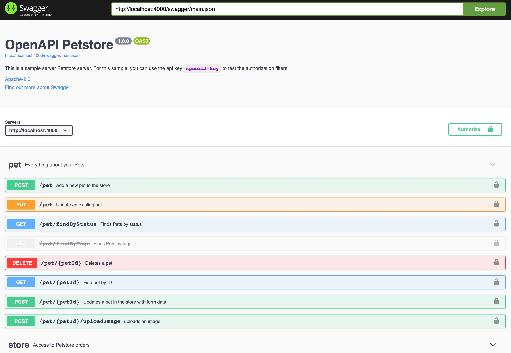
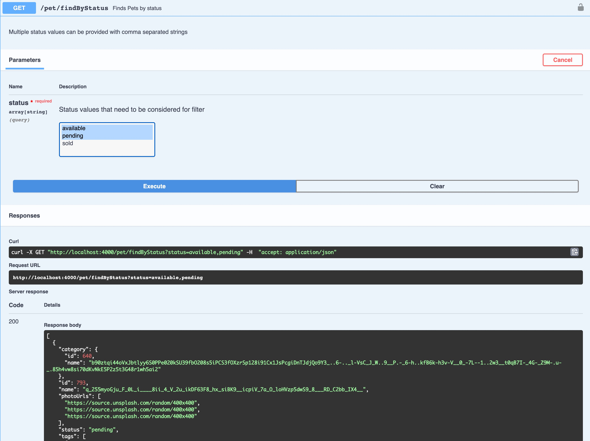

# Quenya

__Disclaimer: Quenya is under active development and is at its early stage. Use with cautions.__

Quenya is a framework to build high-quality REST API applications based on extended [OpenAPI spec](https://github.com/OAI/OpenAPI-Specification/blob/master/versions/3.1.0.md). For the Quenya extension, see [here](docs/quenya_extension.md). With the OAPI spec, Quenya can generate high-quality code for many parts of the API pipeline:

- Preprocessors:
  - [x] request validator: validate the request params
  - [ ] auth handler: process authentication for the API endpoints
  - [ ] access controller: process authorization for the API endpoints
- API handlers:
  - [x] fake API handler to generate a fake response for mocking purpose
  - [ ] gRPC handler to act as a proxy between your client and your gRPC server (require extended OpenAPI grammar)
- Postprocessors:
  - [x] response validator to validate the response body and headers (for dev/testing purpose)

Quenya will also generate property testing, it will use `Plug.Test` and `StreamData` to build tests. Requests (url, query, request headers and request body) will be generated and then sent to generated `Router`, then it will use the response schema to validate the result. Currently the testing only covers happy path.

Quenya will also provide a set of modules, plugs, test helpers to help you build REST APIs easily.

## How to use Quenya?

### Install CLI

First of all, install Quenya CLI:

```bash
$ mix archive.install hex quenya_installer
Resolving Hex dependencies...
Dependency resolution completed:
New:
  quenya_installer 0.3.0
* Getting quenya_installer (Hex package)

20:22:15.605 [info]  erl_tar: removed leading '/' from member names

All dependencies are up to date
Compiling 5 files (.ex)
Generated quenya_installer app
Generated archive "quenya_installer-0.3.0.ez" with MIX_ENV=prod
Are you sure you want to install "quenya_installer-0.3.0.ez"? [Yn]
* creating /Users/tchen/.mix/archives/quenya_installer-0.3.0
```

### Generate APP from an existing OAPI spec

Once you finished installing quenya CLI, you can build a API app with quenya:

```bash
$ cd /tmp
$ curl https://raw.githubusercontent.com/tyrchen/quenya/master/test/fixture/petstore.yml > petstore.yml
$ mix quenya.new petstore.yml petstore
* creating petstore/config/config.exs
* creating petstore/config/dev.exs
* creating petstore/config/prod.exs
* creating petstore/config/staging.exs
* creating petstore/config/test.exs
* creating petstore/lib/petstore/application.ex
* creating petstore/lib/petstore.ex
* creating petstore/mix.exs
* creating petstore/README.md
* creating petstore/.formatter.exs
* creating petstore/.gitignore
* creating petstore/test/test_helper.exs

Fetch and install dependencies? [Yn]
* running mix deps.get
* running mix deps.compile

We are almost there! The following steps are missing:

    $ cd petstore

You can run your app inside IEx (Interactive Elixir) as:

    $ iex -S mix


```

This will create a new elixir app, copy your spec file (or spec folder) to `priv/spec/main.yml`, and generate API code based on the spec.

### Running the app

Now you can run the app:

```bash
$ cd petstore/
$ mix compile.quenya # this command will generate/regenerate code on /gen and /test/gen folders
$ iex -S mix
Erlang/OTP 23 [erts-11.1.3] [source] [64-bit] [smp:16:16] [ds:16:16:10] [async-threads:1] [hipe] [dtrace]

Compiling 44 files (.ex)
Generated petstore app
Interactive Elixir (1.11.2) - press Ctrl+C to exit (type h() ENTER for help)
```

Just run a few commands without writing even a single line of code, you have an API app ready to use. Try open `http://localhost:4000/swagger`. You will see an API playground with standard Swagger UI:



It's great but nothing special. Now, try to invoke one of the APIs, say `GET /pet/findByStatus`:



Amazing! Don't believe what you saw? Try with this command:

```bash
curl -X POST "http://localhost:4000/pet" -H  "accept: application/json" -H  "Content-Type: application/json" -d "{\"name\":\"doggie\",\"photoUrls\":[\"bad url\"]}" -i
HTTP/1.1 400 Bad Request
cache-control: max-age=0, private, must-revalidate
content-length: 33
date: Mon, 30 Nov 2020 04:45:37 GMT
server: Cowboy

Expected to be a valid image_uri.
```

According to [petstore.yml](test/fixture/petstore.yml), request body must be a Pet type, and `name` / `photoUrls` are required. `photoUrls` shall be an array of string, with format as `image_url` (an extended format by quenya). Quenya will validate requests by its schema so here we need a valid url. Let's correct this:

```bash
$ curl -X POST "http://localhost:4000/pet" -H  "accept: application/json" -H  "Content-Type: application/json" -d "{\"name\":\"doggie\",\"photoUrls\":[\"https://source.unsplash.com/random\"]}" -i
HTTP/1.1 200 OK
cache-control: max-age=0, private, must-revalidate
content-length: 376
content-type: application/json; charset=utf-8
date: Mon, 30 Nov 2020 04:51:03 GMT
server: Cowboy

{"category":{"id":683,"name":"Dtlir6vgkz6UeAwK5q4._9--A.--._V_mjp.K--3T.0-e_.7-_qfRmfu"},"id":928,"name":"758Yhl_jx_Rt_fi5fz_JtE_k__JY2J__Tt9Y1","photoUrls":["https://source.unsplash.com/random/400x400","https://source.unsplash.com/random/400x400"],"status":"sold","tags":[{"id":480,"name":"iusto"},{"id":64,"name":"error"},{"id":658,"name":"modi"},{"id":313,"name":"nihil"}]}
```

### Running the tests

Quenya generates property tests for all your API endpoints based on OAPI spec, so before coding your own API handler into the repo, you'd like to be more test-driven, try `mix test` now:

```bash
$ mix test
Compiling 42 files (.ex)
Generated petstore app
............FF......

Finished in 2.7 seconds
20 properties, 2 failures
```

Don't worry too much about two failed cases, Quenya is still early so certain content negotiation type is not supported yet. We will support that soon!

Note these tests covers all success cases. In future, we will try to cover all failed cases in Quenya.

### How much code Quenya generated for you?

If you have `tokei` installed, you can have a basic idea on how much code Quenya generated for you:

```bash
$ tokei gen test
-------------------------------------------------------------------------------
 Language            Files        Lines         Code     Comments       Blanks
-------------------------------------------------------------------------------
 Elixir                 63         5138         4573            0          565
-------------------------------------------------------------------------------
 Total                  63         5138         4573            0          565
-------------------------------------------------------------------------------
```

That's 4.5k LoC for the petstore spec. The more APIs you defined, the more Quenya will do for you. Once we have most of the parts of Quenya built, this number will be much bigger.

Now try edit config:

```elixir
config :quenya,
  use_fake_handler: true,
  use_response_validator: true, # change this to true
  apis: %{}
```

Rerun tokei, you'll get 6k LoC.
### What's under the hood?

Now you have a basic feeling on what's going on. By default, Quenya will generate an API router based on API spec, with a convenient swagger UI. For each route defined in the spec, Quenya will generate a Plug for it. And a Plug is a pipeline which will execute in this order:

- preprocessors: any Plug to be executed before the actual route handler. Here, RequestValidator Plug will help to validate request params against the schema.
- handlers: handlers for the route. This is what you shall put your actual API logic, but for mocking purpose, Quenya generates a fake handler which meets the response schema. In future, Quenya will support gRPC handler which will be very useful if what you need is a grpc proxy (think [grpc-gateway](https://github.com/grpc-ecosystem/grpc-gateway)).
- postprocessors: any Plug to be executed before sending the response. Quenya can generate a ResponseValidator if you need it. It's good for dev/staging purpose. By default it won't generate it.

Quenya consists of 3 parts:

1. quenya_installer: help with Quenya project generation (the CLI you just used).
2. quenya_builder: a code generator to generate API implementation based on extended OpenAPI v3 spec. Every time you run `mix compile`, Quenya will rebuild the spec to code (need improvement here).
3. quenya: a library consist of utility functions, tests and a playground to play with API or API stub.

## What's the generated code?

If you look at the `gen` folder in the newly generated app, you'll find all your routes and routers are organized by `operationId`:

```bash
$ tree -L 1
.
├── Petstore.Gen.ApiRouter.ex
├── Petstore.Gen.Router.ex
├── addPet
├── createUser
├── createUsersWithArrayInput
├── createUsersWithListInput
├── deleteOrder
├── deletePet
├── deleteUser
├── findPetsByStatus
├── findPetsByTags
├── getInventory
├── getOrderById
├── getPetById
├── getUserByName
├── loginUser
├── logoutUser
├── placeOrder
├── updatePet
├── updatePetWithForm
├── updateUser
└── uploadFile

20 directories, 2 files
```

The main router will serve swagger and forward the path (extracted from the spec) to the API router:

```elixir
defmodule Petstore.Gen.Router do
  @moduledoc false
  use Plug.Router
  use Plug.ErrorHandler
  require Logger
  alias Quenya.Plug.SwaggerPlug
  plug Plug.Logger, log: :info
  plug Plug.Static, at: "/public", from: {:quenya, "priv/swagger"}

  plug :match
  plug Plug.Parsers, parsers: [:json], pass: ["application/json"], json_decoder: Jason
  plug :dispatch

  def handle_errors(conn, %{kind: _kind, reason: %{message: msg}, stack: _stack}) do
    Plug.Conn.send_resp(conn, conn.status, msg)
  end

  def handle_errors(conn, %{kind: kind, reason: reason, stack: stack}) do
    Logger.warn(
      "Internal error:\n kind: #{inspect(kind)}\n reason: #{inspect(reason)}\n stack: #{
        inspect(stack)
      }"
    )

    Plug.Conn.send_resp(conn, conn.status, "Internal server error")
  end

  get("/swagger/main.json", to: SwaggerPlug, init_opts: [app: :petstore])
  get("/swagger", to: SwaggerPlug, init_opts: [spec: "/swagger/main.json"])
  forward "/", to: Petstore.Gen.ApiRouter, init_opts: []
end
```

The API router contains code for all routes, for example:

```elixir
put("/user/:username",
    to: RoutePlug,
    init_opts: [
      preprocessors: [Petstore.Gen.UpdateUser.RequestValidator],
      postprocessors: [],
      handlers: [Petstore.Gen.UpdateUser.FakeHandler]
    ]
  )
```

When a `PUT /user/:username` request kicks in, it will be handled by `Quenya.Plug.RoutePlug`, and it will run `preprocessors`, `handlers` and `postprocessors` in the right order.

## Why Quenya?

Building a high-quality HTTP API app is non-trivial. Good APIs have these traits:

For API users:

- Easy to learn and intuitive to use (the app provides full-fledged and good quality docs / playground)
- Hard to misuse (API is type-safety and provides proper error responses)
- Powerful enough to drive business requirements (flexible, performant)
- Easy to evolve as the products grow
- Opinionated (don't make me think)

For developers:

- Easy to read and maintain existing code
- Easy to write new APIs / extend existing APIs
- Easy to generate code based on API spec (client SDKs, test cases, and even server implementation)

API implementation is just a small part of the API lifecycle, we need API design, mocking, testing, simulating, documentation, deployment, etc.


Quenya tries to help you start with the API spec, iterate it without writing the code, while at the same time various teams can play with the mocking server based on the spec to nail down what is actually needed. We believe this is the best approach to improve productivity.

## Why not GraphQL or other solutions?

I've used GraphQL in many projects, I even built a tool called [goldorin](https://hex.pm/packages/goldorin) to generate Absinthe/Ecto code from a homebrewed spec language called `goldorin`. GraphQL has its advantages like:

- Easy to use (GraphQL playground is even greater than swagger!)
- Flexible query makes clients easy to get the right amount of data it needs
- Save client API requests round trips Subscription is great for building event driven apps
- A good aggregate layer to micro services Apollo toolchain is pretty decent
- Good ecosystem (e.g. AWS AppSync support it)

But it also has many drawbacks, which is more serious than its advantages:

- A big learning curve for both client and server devs
- Breaks general HTTP ecosystem
      - Every request is a POST (breaks caching)
      - Every response is 200 (breaks the HTTP semantics)
      - All APIs inside a schema point to the same API location (breaks URI based routing, and monitoring ecosystem)
- Complexity of a query sometimes pretty tricky
- N + 1 problem (dataloader fixed part of the issue)
- Need extra work for logging, monitoring, caching, etc. (a big headache)
